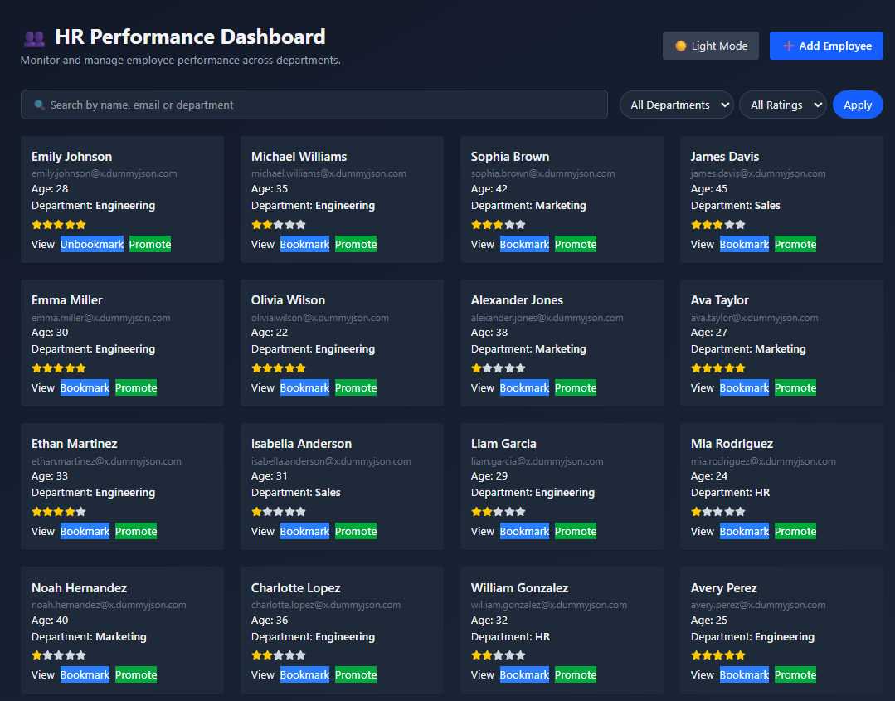
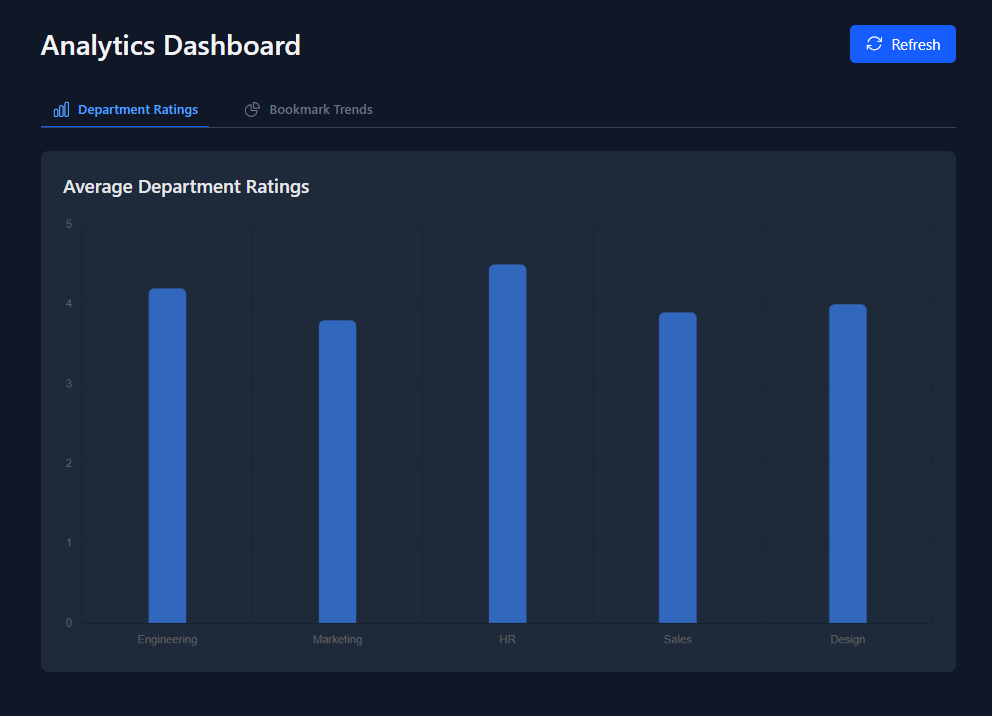

# 💼 HR Dashboard (Advanced)  

  

A modern HR analytics dashboard built with **React 19 + Vite**, featuring employee management, real-time charts, dark mode, and seamless data visualization.  

## 🌟 Key Features  

### 🧑‍💼 Employee Management  
- 🔍 Smart search by name/email/department  
- ⭐ Bookmarking with localStorage persistence  
- ♾️ Infinite scroll loading  
- ➕ Add new employees (form validation)  

### 📊 Data Visualization  
- 📈 Interactive charts (Chart.js)  
- 📅 Monthly performance trends  
- 🏆 Department-wise ratings  

### 🎨 UI/UX  
- 🌓 Dark/light mode toggle  
- 📱 Fully responsive (Tailwind CSS)

## 🖥️ Screenshots  

| Dashboard | Analytics |    
|-----------|-----------|
|  |  |

## 🛠 Tech Stack  

**Frontend**  
- React 19 + Vite  
- Tailwind CSS  
- React Router v7  

**Data**  
- Chart.js  
- DummyJSON API  

**State Management**  
- Context API  
- Custom hooks  

## 🏗️ Project Structure  
src/
├── components/ # UI Components
├── context/ # Theme/Bookmark providers
├── hooks/ # useFetch, useInfiniteScroll
├── pages/ # Routes
├── styles/ # Tailwind config
└── utils/ # Helpers & mock data


## 🚀 Installation  

1. Clone repo:  
   ```bash
   git clone https://github.com/nani-tyson/Hr-dashboard

   Install dependencies:
    npm install
   Start dev server:
    npm run dev